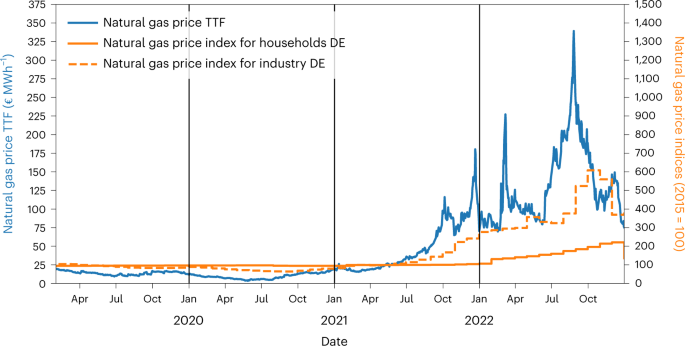

```{r setup, include=FALSE}
knitr::opts_chunk$set(echo = TRUE)
library(tidyverse)
library(lubridate)
```

## Overview

In the `data` directory of this project you will find the file from a paper published in *Nature Energy* titled [Natural gas savings in Germany during the 2022 energy crisis](https://www.nature.com/articles/s41560-023-01260-5). Here is the abstract of the article:

> Russia curbed its natural gas supply to Europe in 2021 and 2022, creating a grave energy crisis. This Article empirically estimates the crisis response of natural gas consumers in Germany—for decades, the largest export market for Russian gas. Using a multiple regression model, we estimate the response of small consumers, industry and power stations separately, controlling for the nonlinear temperature-heating relationship, seasonality and trends. We find significant and substantial gas savings for all consumer groups, but with differences in timing and size. For instance, industry started reducing consumption as early as September 2021, while small consumers saved substantially only since March 2022. Across all sectors, gas consumption during the second half of 2022 was 23% below the temperature-adjusted baseline. We discuss the drivers behind these savings and draw conclusions on their role in coping with the crisis.

Your job in this project falls into two categories:

1. A set of **tasks** that your group must complete exactly
2. A set of **objectives** that are more general in their approach.

## Tasks

* Load two files. To work in the console, use the `Session -> Set Working Directory -> To Source File Location`.
    * Call the first table `daily`: "./data/natural_gas_germany_daily.csv"
    * Call the second table `gas`: "./data/dutch_ttf_natural_gas.csv". Be sure to properly import the `Date` column.
    * Demonstrate that these have been loaded by showing the number of rows and columns in each table.
* The data in `daily` are collected over days, with information on different types of natural gas consumption (`consumption_small`, `consumption_industry`, `consumption_power`). Provide summaries of typical values for each of these three types of consumption.
* Answer some questions about the data in `daily`:
   * How many weeks of data are contained in the data set?
   * How much did consumption as a percentage change for each category?
   * What proportion of the data are during holidays?
   * Which month (with January 2017 being distinct from January 2018, etc.) had the highest total consumption for the power production segment (`consumption_power`)?
* The original paper aggregated the data to monthly means for each consumption type in `daily` and the `Price` column of `gas` to produce the following image:<br/>
<br/>
Produce plots that show the same information that is presented in this plot. Your plots do not have to have the same colors or markings, but we should be able to use them to compare the trends for the three price variables. 
* Write a predicate function that returns true if any value in vector is missing. Use this function to find columns with missing values in the `daily` column. Create a plot or table that shows how often patterns of missingness occur: are all of the missing values in the same rows or are the various columns missing data in different ways?
* Limit the `gas` table to days where the price exceeded the yearly median. Use the concept of circular means to compute the average day of the year when price exceeds the yearly median price. The `yday` function will likely be useful here. 
* Using the cut function, create two nominal variables from quantitative data in the `daily` dataset. Use these groups to summarize the data. Use arrange to show the smallest or largest values in these comparisons.
* There are several variables that pull out data by different industry (the `_idx` columns). Create a table for these columns using `select` and the `ends_with` function. Provide two different plots that show of the relations between these variables (you do not need to have all variables in each plot).

## Objectives
* Produce at least five more figures. For each figure, write a brief caption explaining the plot and what you have learned from the plot. Each figure should attempt to provide new insight into the data set not included elsewhere
    * A marginal distribution
    * A joint distribution
    * A plot of a summary measure such as a conditional mean
    * A plot using `facet_wrap` or `facet_grid`
    * A plot that shows seasonal effects before the crisis (September 2021 until October 2022)
* Compare and contrast holidays and non-holidays for household energy consumption. Select 3 ways of comparing these groups. Provide at least one graph.
* According to the paper, the gas crisis occurred between September 2021 until October 2022. Compare this period with the periods before and after on household and industrial consumption. Write a paragraph explaining your findings.
* Explore the [documentation for ggplot](https://ggplot2.tidyverse.org/). Select one geometery and one `stat_` function we have not used before or use an option to a previously used geometry/stat with a new option. Write a short paragraph explaining what the plots show. 
* Investigate solar radiation's marginal distribution and also it's relationship with temperature.
* Use `group_by` to summarize by a new feature of this data set not otherwise discussed in the tasks or objectives. What have you learned with these investigation?
* Based on your exploration of the data, suggest three questions that could be asked from these data or additional data that you can imagine. Be sure to explain why the previous plots or calculations indicates that this would be an interesting our useful exploration.
* Write an abstract for your project. Briefly explain what you did, what you found, and why a potential reader should be interested in your research.

## Example Solutions

### Loading Data

```{r}
daily <- read_csv("./data/natural_gas_germany_daily.csv")
gas   <- read_csv("./data/dutch_ttf_natural_gas.csv") |> mutate(Date = mdy(Date))
```


###  Summaries by type

> The data in `daily` are collected over days, with information on different types of natural gas consumption (`consumption_small`, `consumption_industry`, `consumption_power`). Provide summaries of typical values for each of these three types of consumption. Consider if you can use pivoting to provide an elegant solution to summarizing these data.

Basic solution: These solutions just run the summary functions directly.

```{r}
daily |>
  summarize(mean(consumption_small, na.rm = TRUE), median(consumption_industry, na.rm = TRUE))
```

Better solution uses pivoting:

```{r}
daily |>
  pivot_longer(starts_with("consumption_"), names_to = "consumption_type", values_to = "consumption_amount") |>
  group_by(consumption_type) |>
  summarize_at("consumption_amount", list(mean = mean, median = median, variance = var), na.rm = TRUE)
```

## Answer some questions about the data in `daily`:

   * How many weeks of data are contained in the data set?
   * How much did consumption as a percentage change for each category?
   * What proportion of the data are during holidays?
   * Which month (with January 2017 being distinct from January 2018, etc.) had the highest total consumption for the power production segment (`consumption_power`)?

```{r}
summarize(daily,
          as.numeric(max(date) - min(date), "weeks"))

daily |> pivot_longer(starts_with("consumption_"), names_to = "consumption_type", values_to = "consumption_value") |>
  group_by(consumption_type) |>
  summarize(percent_change = (first(consumption_value, na_rm = TRUE) - last(consumption_value, na_rm = TRUE)) / first(consumption_value, na_rm = TRUE) )

summarize(daily,
          mean(holiday))

daily |> group_by(year(date), month(date)) |>
  summarize(total_power = sum(consumption_power)) |>
  arrange(desc(total_power)) |> head(1)
```

## Recreating Plot

The original paper aggregated the data to monthly means for each consumption type in `daily` and the `Price` column of `gas` to produce the following image:<br/>
<br/>
Reproduce this figure. You do not have both scales or the vertical bars indicating years.

### Method 1: joining tables

```{r}
monthly_avgs <- inner_join(daily,
                           gas,
                           by = c("date" = "Date")) |>
  pivot_longer(c("Price", "price_households_idx", "price_industry_idx"),
               names_to = "price_type",
               values_to = "price_value") |>
  group_by(year(date), month(date), price_type) |>
  summarize(price_value = mean(price_value, na.rm = TRUE)) |>
  ungroup() |>
  mutate(month_date = ym(paste(`year(date)`, `month(date)`, sep = "/")),
         price_type = fct_recode(price_type,  "Natural Gas Price TTF" = "Price", 
                                              "Natural gas price index for households" =  "price_households_idx",
                                              "Natural gas price index for industry" = "price_industry_idx"))

ggplot(monthly_avgs, aes(x = month_date, y = price_value, color = price_type)) + geom_line()
```

### Method 2: multiple geometries

```{r}

daily_avgs <- group_by(daily, year(date), month(date)) |>
  summarize_at(c("price_industry_idx", "price_households_idx"), mean, na.rm = TRUE) |>
  mutate(month_date = ym(paste(`year(date)`, `month(date)`, sep = "/")))

gas_avgs <- group_by(gas, year(Date), month(Date)) |>
  summarize(Price = mean(Price)) |>
  mutate(month_date = ym(paste(`year(Date)`, `month(Date)`, sep = "/")))

ggplot(daily_avgs, mapping = aes(x = month_date)) +
  geom_line(data = daily_avgs, mapping = aes(y = price_industry_idx), color = "orange") +
  geom_line(data = daily_avgs, mapping = aes(y = price_households_idx), color = "blue")  +
  geom_line(data = gas_avgs, mapping = aes(y = Price), color = "green") 
  
```

##  Produce at least four more figures. 

For each figure, write a brief caption explaining the plot and what you have learned from the plot.
    * A marginal distribution
    * A joint distribution
    * A plot of a summary measure such as a conditional mean
    * A plot using `facet_wrap` or `facet_grid`
    
```{r}
ggplot(data = daily, aes(x = solar_radiation)) + geom_boxplot()
```


```{r}
ggplot(data = daily, aes(x = solar_radiation, y = temperature)) + geom_point()
```
```{r}
ggplot(data = daily, aes(x = solar_radiation, y = temperature)) + geom_smooth()
```
```{r}
ggplot(daily, aes(x = consumption_small, y = consumption_industry)) + geom_point() + facet_wrap(~ holiday)
```

# Compare and contrast holidays and non-holidays 

for household energy consumption. Select several ways of comparing these groups. Provide at least one graph.

```{r}
group_by(daily, holiday) |>
  summarize(mean(consumption_small),
            sd(consumption_small))

ggplot(daily, aes(x = as.factor(holiday), y = consumption_small)) + geom_boxplot()
```


## Crisis period

According to the paper, the gas crisis occurred between September 2021 until October 2022. Compare this period with the periods before and after on household and industrial consumption. Write a paragraph explaining your findings.

```{r}
mutate(daily, crisis = date > "2021-09-01" & date <= "2022-10-31") |>
  group_by(crisis) |>
  summarize(across(c("consumption_small", "consumption_industry"), list(mean = mean, med = median, sd = sd), na.rm = TRUE)) |> t()
```
## Three Questions

* Based on your exploration of the data, suggest three questions that could be asked from these data or additional data that you can imagine.